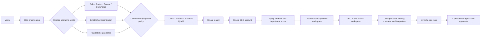
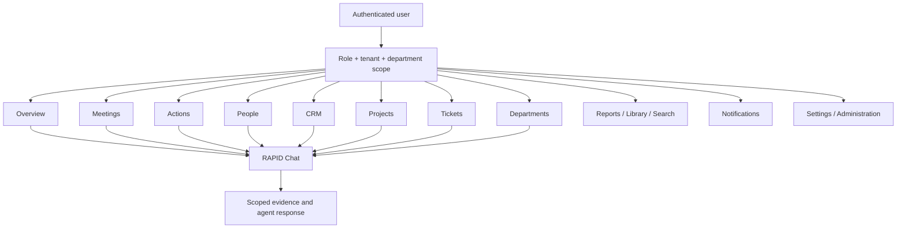
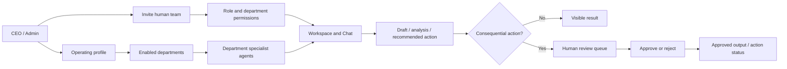
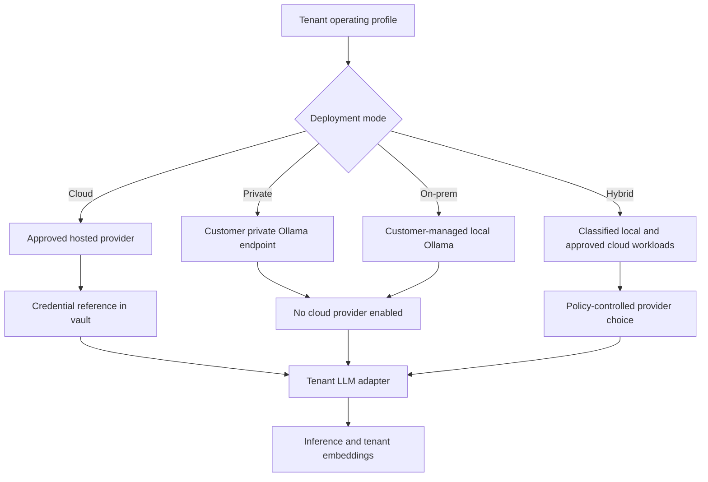
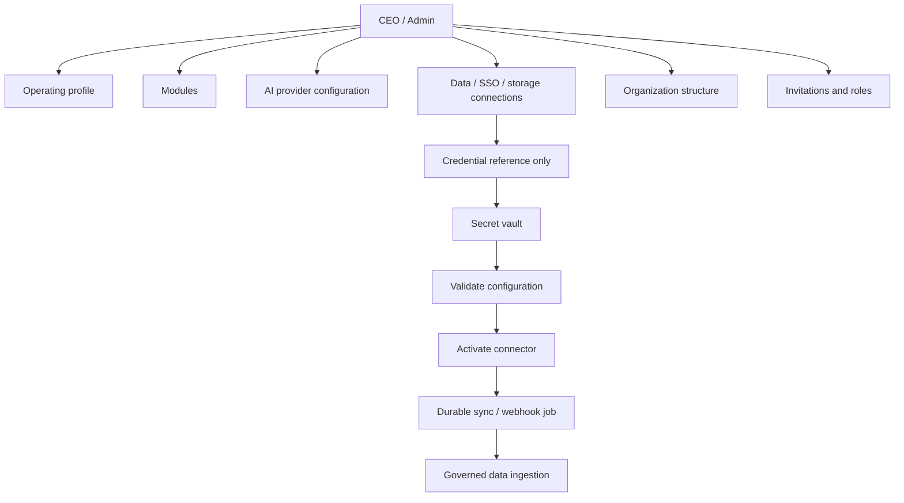
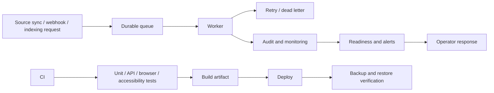
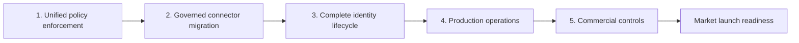

# RAPID Product Workflows

This map describes the current product flow and the production work still required. RAPID is one tenant-aware organization operating system: customers choose an operating model, RAPID provisions a governed workspace, and people use department-scoped intelligence and work surfaces.

## 1. Customer Lifecycle

**Implemented:** `Start organization` through `CEO enters RAPID workspace`.

**Critical production gap:** configured connections need a policy-enforced, credential-safe activation and sync path before customer data is ingested.

## 2. Common Portal

**Implemented:** all listed product pages use the shared React shell. Navigation hides modules disabled by the tenant profile.

## 3. Human and Agent Operating Model

**Implemented:** tenant and department scopes, RAPID Chat, project skills, generated-output review, action tracking, and meetings.

**Critical gap:** invitation acceptance and production SSO provisioning are not yet complete customer workflows.

## 4. Data and RAG Pipeline

```mermaid
flowchart LR
    A[Manual upload / structured records] --> B[Source registration]
    B --> C[Classification and department permission]
    C --> D[Extract text / OCR]
    D --> E[PII detection and redaction]
    E --> F[Durable indexing job]
    F --> G[Embeddings]
    G --> H[Tenant-scoped vector / lexical retrieval]
    H --> I[RAPID Chat, Search, Reports, Agents]
    I --> J[Citations, confidence, and audit context]
```

**Implemented:** the governed organization-data path supports source registration, file extraction/OCR, PII handling, classification, tenant/department permissions, durable indexing, embeddings, and scoped retrieval.

**Current product control:** legacy direct cloud connectors are disabled by default with `RAPID_ENABLE_LEGACY_CLOUD_CONNECTORS=false`. They remain migration-only routes until they are replaced by tenant-scoped connectors with permission-aware ingestion, durable sync, and audit records.

## 5. AI Deployment Policy

**Implemented:** profile policy persists per tenant; private/on-prem blocks OpenRouter; tenant runtime uses a vault/env credential reference instead of global keys.

**Critical gap:** extend the same policy resolver to every legacy inference, embedding, and connector route so no fallback can bypass customer residency requirements.

## 6. Administration and Connections

**Implemented:** module, model, connection, organization-structure, and invitation configuration screens. Credentials are stored as references, not in configuration records.

**Critical gap:** validation, OAuth acceptance, token storage, connector activation, and governed sync need to become one complete workflow.

## 7. Production Operations

**Implemented:** queue, worker contracts, readiness, browser/accessibility E2E coverage, and local Docker definitions.

**Critical gap:** managed deployment, production observability, backup/restore drills, load testing, and compliance evidence collection.

## Critical Work Order

1. **Unified policy enforcement:** one tenant-scoped AI/data policy must be consulted by inference, embeddings, RAG, and connectors; deny disallowed fallback and egress.
2. **Governed connector migration:** replace legacy token storage and tenant-unsafe ingestion with vault-backed, tenant-bound OAuth/connectors that enter the governed RAG pipeline.
3. **Complete identity lifecycle:** invitation delivery/acceptance, SSO provisioning, tenant-scoped user administration, password reset, and audit trails.
4. **Production operations:** deployment topology, monitoring, backups/restores, security scans, load and mobile/browser testing.
5. **Commercial controls:** billing, entitlements, trial lifecycle, support workflow, and legal/compliance pages.

The first critical implementation slice is **Unified policy enforcement plus governed connector migration**. It protects every customer profile, especially regulated and local-model deployments, and makes the rest of the product safe to activate with real customer data.
